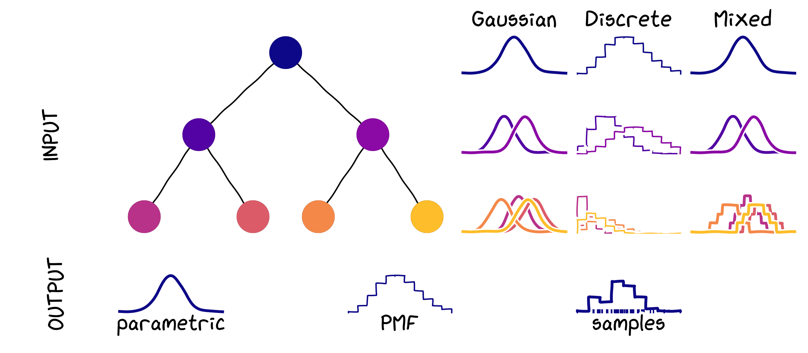

# Summary

`BayesReconpy` implements methods for probabilistic forecast reconciliation in Python. It reconciles hierarchies containing real-valued time series,  discrete time series and a mixture of real-valued and discrete time series (mixed hierarchies).

# Statement of Need

Forecast reconciliation ensures coherence across hierarchical time series, where aggregate forecasts must equal the sum of their components. In practice, base forecasts—generated independently for each series—often violate these constraints.

Initial approaches addressed point forecasts using projection methods like OLS and MinT [@Hyndman_Ahmed_Athanasopoulos_Shang_2011; @Wickramasuriya_Athanasopoulos_Hyndman_2019]. More recently, probabilistic reconciliation methods have been introduced, providing richer uncertainty quantification [@Jeon_Panagiotelis_Petropoulos_2019; @Panagiotelis_Gamakumara_Athanasopoulos_Hyndman_2023].

However, most existing tools are limited to Gaussian or continuous inputs, lack support for discrete or mixed-type forecasts, or are implemented only in R. Some, like ProbReco [@ProbReco2020] and DiscreteRecon [@discreterecon], are no longer actively maintained, whereas pyhts [@pyhts2022] does only point forecast reconciliation. A Python package covering both projection and a Bayesian method was prepared in reconcile [@dirmeier2025reconcile], but it's not complete and mentions the reconciliation functions to "loosely follow...but is not the same method". 

`bayesReconPy` addresses these gaps. It provides a unified Python interface for probabilistic reconciliation using both conditioning and projection-based methods. It supports:

- Gaussian forecasts [@Corani_Azzimonti_Augusto_Zaffalon_2021]  
- Continuous non-Gaussian forecasts [@Zambon_Azzimonti_Corani_2024]  
- Discrete forecasts [@CoraniAzzimontiRubattu2024]  
- Mixed discrete-continuous hierarchies [@zambon2024probabilistic]

As a Python-native extension of the R package `bayesRecon`, `bayesReconPy` is the only actively maintained tool of its kind. It includes extensive documentation and example notebooks replicating key results from the literature.
 [@Corani_Azzimonti_Augusto_Zaffalon_2021; @CoraniAzzimontiRubattu2024; @Zambon_Azzimonti_Corani_2024].

### Table 1: Probabilistic reconciliation methods comparison

| Library                                                  | Cross-temp | Gaussian | Continuous (non-Gaussian) | Discrete | Mixed |
|----------------------------------------------------------|:----------:|:--------:|:-------------------------:|:--------:|:-----:|
| **bayesReconPy (Ours)**                                  |     X      |    V     |             V             |    V     |   V   |
| fable / fabletools [@fable_O_Hara_Wild_etal2024]         |     V      |    V     |             V             |    X     |   X   |
| FoReco [@FoReco]                                         |     V      |    V     |             V             |    X     |   X   |
| gluonts [@gluonTS_Alexandrov_etal2020]                   |     X      |    V     |             V             |    X     |   X   |
| hierarchicalforecast [@olivares2022hierarchicalforecast] |     X      |    V     |             V             |    X     |   X   |
| thief [@thief_HyndmanKourentzes2018]                     |     X      |    V     |             X             |    X     |   X   |
| scikit-hts [@scikit-hts]                                 |     X      |    V     |             V             |    X     |   X   |
| reconcile [@dirmeier2025reconcile]                       |     X      |    V     |             V             |    X     |   X   |
**Note**: `V` = Supported, `X` = Not supported

# Usage

A hierarchy can contain Gaussian, continuous non-Gaussian, or discrete forecast distributions at different levels (see **Figure 1**). Base forecasts can be provided as parameters, samples, or probability mass functions (PMFs), depending on whether they are continuous or discrete.

  
*Figure 1: Types of reconciliation and output forms.*

Below, we describe the suitable reconciliation algorithms for each case:

1. **All Gaussian forecasts**  
   Use `reconc_gaussian` for analytical reconciliation (MinT)  
   _[@Corani_Azzimonti_Augusto_Zaffalon_2021; @Wickramasuriya_Athanasopoulos_Hyndman_2019]_

2. **All continuous or all discrete forecasts**  
   Use `reconc_buis` for sample-based reconciliation  
   _[@Zambon_Azzimonti_Corani_2024]_

3. **Mixed types (discrete bottom, Gaussian upper)**  
   Use `reconc_mix_cond` or `reconc_td_cond`  
   _[@zambon2024probabilistic]_

#### Output formats by method:

- **Parametric** → `reconc_gaussian`
- **Samples** → `reconc_buis`
- **PMF** → `reconc_mix_cond`, `reconc_td_cond`

Note that in the case of MinT or OLS reconciliation, the inputs and outputs are expected as NumPy arrays. Documentation for the expected shape of these arrays is provided in the function descriptions.

## Examples

### Reconciliation of Negative Binomial Forecasts

We illustrate the use of `bayesReconPy` on a hierarchy of count-valued time series representing extreme market events across five economic sectors from 2005 to 2018. These predictive distributions are modeled using negative binomial distributions, and the hierarchy includes five bottom-level and one top-level series.

The dataset `extr_mkt_events`, included in the package, provides both the observed series and corresponding base forecasts. This dataset was used in the experiments reported in [@ZAMBON20241438].

A related Python notebook demonstrating this example is available:  
[Properties of the Reconciled Distribution via Conditioning](https://github.com/supsi-dacd-isaac/BayesReconPy/blob/main/notebooks/Properties%20of%20the%20reconciled%20distribution%20via%20conditioning.ipynb)

The code example shows how to apply the `reconc_buis` function using the summing matrix `A`, base forecast parameters, and the desired number of samples. Reconciliation is completed within seconds.
```python
# Reconcile via importance sampling
buis = reconc_buis(A, base_fc_j, 
        "params", "nbinom",
        num_samples=N_samples, seed=42)
samples_y = buis['reconciled_samples']
# Computational time for 3508 reconciliations: 20.13 seconds
```

### Reconciliation of a Large Mixed Hierarchy

The M5 dataset [@MAKRIDAKIS20221325] contains daily sales time series for 10 stores, each with 3049 bottom-level and 11 upper-level series. Existing reconciliation methods struggled with the hierarchy’s scale and the requirement for non-negative forecasts.

`bayesReconPy` successfully reconciles 1-step-ahead forecasts for store `"CA_1"`, producing non-negative, probabilistic outputs. The base forecasts, generated using the ADAM method [@svetunkov2023iets] via the `smooth` R package [@smooth_pkg], are included in the package.

A Python notebook illustrating this use case is available:  
[Reconciliation of M5 hierarchy with mixed-type forecasts](https://github.com/supsi-dacd-isaac/BayesReconPy/blob/main/notebooks/Reconciliation%20of%20M5%20hierarchy%20with%20mixed-type%20forecasts.ipynb)

The example below demonstrates reconciliation using `reconc_td_cond`, where bottom-level forecasts are discrete and upper-level forecasts are continuous. Reconciliation completes in seconds.
```python
N_samples_TD = int(1e4)

# TDCond reconciliation
start = time.time()
td = reconc_td_cond(
    A,
    fc_bottom_4rec, 
    fc_upper_4rec, 
    bottom_in_type="pmf",
    num_samples=N_samples_TD, 
    return_type="pmf", 
    seed=seed
)
stop = time.time()

# Reconciliation time: 10.11 s
```


# Acknowledgements

Research funded by the Swiss National Science Foundation (grant 200021_212164), the European Union (project: 101160720 — ENERGENIUS), and the Swiss State Secretariat for Education, Research and Innovation (SERI) in the context of the Horizon Europe research and innovation programme project DR-RISE (Grant Agreement No 101104154).

# References